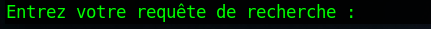

# README LAZY-SECURITY

<div style="display:flex; justify-content:space-between">
    
    
    
</div>


<br/><br/>

--------------------------------------------------------------------------------------------------------------------------------------------------------------------
## Pour commencer

Ce Projet est composé de différents outils open source, qui a pour but d'automatiser les détections de vulnérabilités, mais également de réaliser de la recherche d'informations.

Vous trouverez le code décrit précisement dans le document : README_EVOLVE  


Il est recommandé d'utiliser une distribution Parrot OS possédant la majorité des dépendances.
Il n'est pas compatible avec un environnement Windows.


                          **                                                 **                     
                         ****                                               ****                    
                        ******                                             ******                   
                       ********                                           ********                  
                      *** || ***                                         *** || ***                 
                     ***  ||  ***                                       ***  ||  ***                
                    ***   ||   ***                                     ***   ||   ***               
                   ***    ||    ***                                   ***    ||    ***              
                  ***     ||     ***                                 ***     ||     ***             
                 **                **                               **                **            
                **        OO        **                             **        OO        **           
               ************************                           ************************          
              

  OPENVAS est actuellement defectueux sur Parrot OS   

- Pour corriger le probleme il faut copier les répertoirs présent dans le dossier /lib64/libopenvas* Dans le dossier /lib/
-------------------------------------------------------------------------------------------------------------------------------------------------------------------

### Prérequis

- python3 
- powershell
- nmap
- nikto
- pip
- Openvas
- Diverses dépendances lisibles dans le fichier "dépendances.txt"
--------------------------------------------------------------------------------------------------------------------------------------------------------------------
### Execution

Il est fortement recommandé d'effectuer le "git clone" dans un dossier isolé.


<br/><br/>

Récupération des Fichiers d'exécution : 

```bash
git clone https://github.com/JulienRopert/LAZY-SECURITY
```     
--------------------------------------------------------------------------------------------------------------------------------------------------------------------

```bash
cd LAZY-SECURITY
```
--------------------------------------------------------------------------------------------------------------------------------------------------------------------
<br/><br/>
                                        
                                       
- Installation des dépendances
 
 <br/><br/>     
 
 

<br/><br/>     
--------------------------------------------------------------------------------------------------------------------------------------------------------------------

```bash
sudo chmod 777 requirements.sh
```
--------------------------------------------------------------------------------------------------------------------------------------------------------------------

<br/><br/>
--------------------------------------------------------------------------------------------------------------------------------------------------------------------
```bash
./requirements.sh
```
--------------------------------------------------------------------------------------------------------------------------------------------------------------------

<br/><br/>


Exécution du script (dans le dossier courant) : 

--------------------------------------------------------------------------------------------------------------------------------------------------------------------

```bash
pwsh Security-Scan-PWDJR.ps1
```
--------------------------------------------------------------------------------------------------------------------------------------------------------------------


## Fonctionnalités

--------------------------------------------------------------------------------------------------------------------------------------------------------------------
--------------------------------------------------------------------------------------------------------------------------------------------------------------------
--------------------------------------------------------------------------------------------------------------------------------------------------------------------
- Readme
    
    - Conditions d'utilisations 
    
        Le toolbox a pour seul objectif d'améliorer la sécurité des systèmes d'information et non à exploiter les informations récupérées. 

        L’article 323-1 du Code pénal sanctionne«le fait d’accéder ou de se maintenir frauduleusement "
        dans tout ou partie d’un système de traitement automatisé». La peine encourue est 2 ans d’emprisonnement "
        et 30000€ d’amende. Celle-ci peut être portée à 3 ans d’emprisonnement et 45000€ d’amende lorsqu’il en résulte "
        «soit la suppression, soit la modification de données contenues dans le système, soit une altération du fonctionnement de ce système».
    
    - Lecture des Dépendances

 Permets d'afficher toutes les dépendances nécessaires au bon fonctionnement du script. 

  
--------------------------------------------------------------------------------------------------------------------------------------------------------------------
--------------------------------------------------------------------------------------------------------------------------------------------------------------------

- Détecteur de vulnérabilités
    
    - Webapp

        Fonctionnalité qui permet de scanner les vulnérabilités d'un serveur web, exécute à la suite un scan NMAP et NIKTO, avec une boite de dialogue interactif. Génère un résultat sous forme TXT dans le dossier Résultats sous la forme suivante : (nmap $target.txt) et (nikto $target.txt).

    
    
--------------------------------------------------------------------------------------------------------------------------------------------------------------------
--------------------------------------------------------------------------------------------------------------------------------------------------------------------
        
   - Interne/OPENVAS

        Effectue un scan à l'aide d'OPENVAS GREENBONE vous pouvez consulter l'avancer sur la console web https://127.0.0.1:9392/login"
        Vous pouvez exporter le résultat en PDF en exécutant ./pdf_openvas.sh, vous aurez besoin de l'id générer dans le document Scan_OPENVAS_ID.txt"
        Le scan prend un certain temps, il est conseillé de consulter l'avancée de celui-ci via l'interface web avant de générer un résultat en PDF.
--------------------------------------------------------------------------------------------------------------------------------------------------------------------
--------------------------------------------------------------------------------------------------------------------------------------------------------------------
--------------------------------------------------------------------------------------------------------------------------------------------------------------------
-  OSINT

    - Google Dorks

        Cet outil permet d'effectuer des recherches précises avec la méthode "Google Dorks" 
        Dork : la requête de recherche que vous souhaitez utiliser
        Page : le nombre de sites Web à afficher
        Time : intervalle entre les demandes

        Ci-joint une documentation sur les recherches de type DORK : https://www.funinformatique.com/google-dorks-hackez-requete-google/
        
        <br/><br/>  
        
.

<br/><br/> 

- Recherche de fichiers spécifiques sur un site Web :

```bash
site:example.com filetype:pdf
```
Cela retournera tous les fichiers PDF sur le site example.com.

<br/><br/> 

- Recherche de pages contenant des informations sensibles :
```bash
site:example.com intitle:"Index of /" password
```
Cela retournera toutes les pages sur le site example.com qui contiennent le mot de passe dans le titre et qui ont une URL qui inclut "Index of /".

<br/><br/>  

- Recherche de pages vulnérables à l'injection SQL :
```bash
site:example.com inurl:.php?id= intext:"SQL injection"
```
Cela retournera toutes les pages sur le site example.com qui ont une URL qui inclut ".php?id=" et qui contiennent le terme "SQL injection" dans le texte de la page.

<br/><br/>  

- Recherche de systèmes vulnérables à la prise de contrôle à distance :
```bash
intitle:"Welcome to the Web-Based Configurator" inurl:login.asp
```
Cela retournera toutes les pages sur le Web qui ont le titre "Welcome to the Web-Based Configurator" et qui ont une URL qui inclut "login.asp", ce qui peut être un signe que le système est vulnérable à la prise de contrôle à distance.

<br/><br/>  

- Recherche de fichiers de sauvegarde non sécurisés :
```bash
site:example.com intitle:"Index of /" backup
```
Cela retournera toutes les pages sur le site example.com qui ont le titre "Index of /" et qui contiennent le mot "backup" dans l'URL, ce qui peut indiquer la présence de fichiers de sauvegarde non sécurisés.

<br/><br/>  

- Recherche de pages contenant des informations sensibles dans l'URL :
```bash
site:example.com inurl:admin password
```
Cela retournera toutes les pages sur le site example.com qui ont "admin" dans l'URL et qui contiennent le mot de passe dans le contenu de la page. Cette requête est souvent utilisée pour trouver des pages d'administration de site Web vulnérables.

<br/><br/>  

--------------------------------------------------------------------------------------------------------------------------------------------------------------------
--------------------------------------------------------------------------------------------------------------------------------------------------------------------
- WebScrapping

L’outil est capable d’effectuer diverses opérations comme trouver des sous-domaines, la technologie Web, panneau d’administration, répertoire, entête HTTP, informations WHOIS, balayage de port, balayage TCP/UDP, recherche inverse IP, recherche de sous-réseau, géolocalisation, recherche DNS, tracé, détection de pare-feu, analyse de vulnérabilité et transfert de zone.

 -  Utilisation 

 Saisissez l’adresse cible (par exemple, adresse.com ou IP).
 Choisissez une option dans le menu.
 Suivez les instructions à l’écran.
        
   

.
.
       
--------------------------------------------------------------------------------------------------------------------------------------------------------------------
--------------------------------------------------------------------------------------------------------------------------------------------------------------------
--------------------------------------------------------------------------------------------------------------------------------------------------------------------
--------------------------------------------------------------------------------------------------------------------------------------------------------------------
--------------------------------------------------------------------------------------------------------------------------------------------------------------------

## Sources :

- https://github.com/Encryptor-Sec/Web-Scraper
- https://github.com/greenbone/gvm-tools
- https://nmap.org/book/man-briefoptions.html
- https://www.mankier.com/1/nikto

--------------------------------------------------------------------------------------------------------------------------------------------------------------------
--------------------------------------------------------------------------------------------------------------------------------------------------------------------
--------------------------------------------------------------------------------------------------------------------------------------------------------------------
--------------------------------------------------------------------------------------------------------------------------------------------------------------------
--------------------------------------------------------------------------------------------------------------------------------------------------------------------

## Versions

**Dernière version stable :** 5.1
**Dernière version :** 5.1

## Auteurs
[@JulienRopert](https://github.com/JulienRopert)


